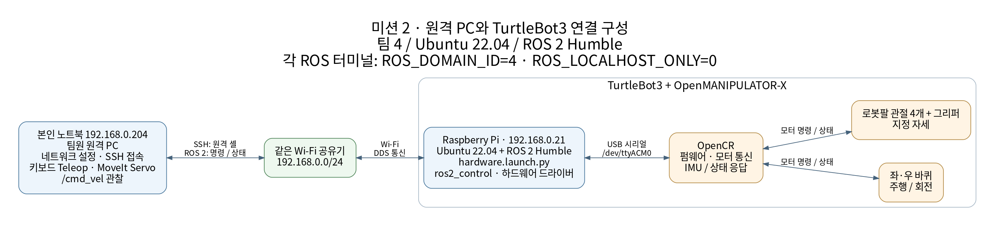
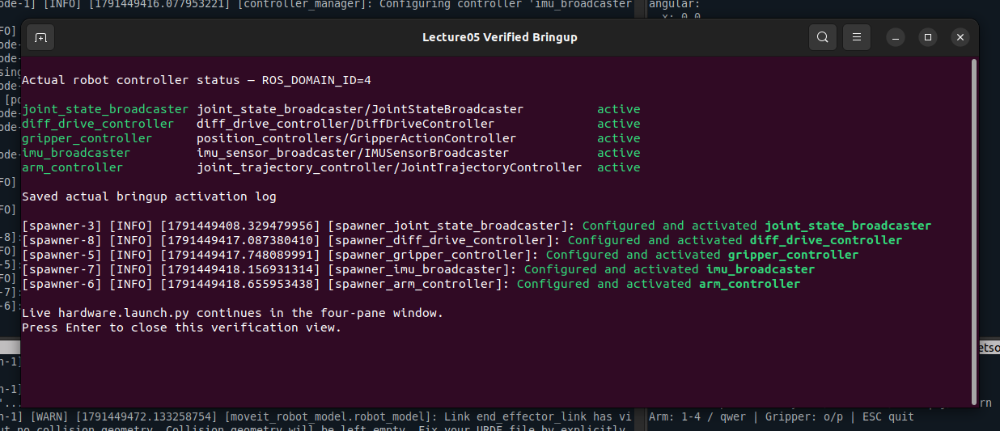
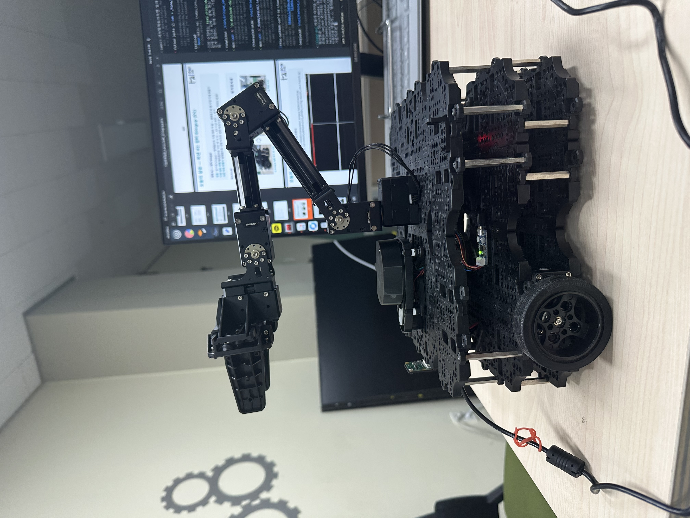
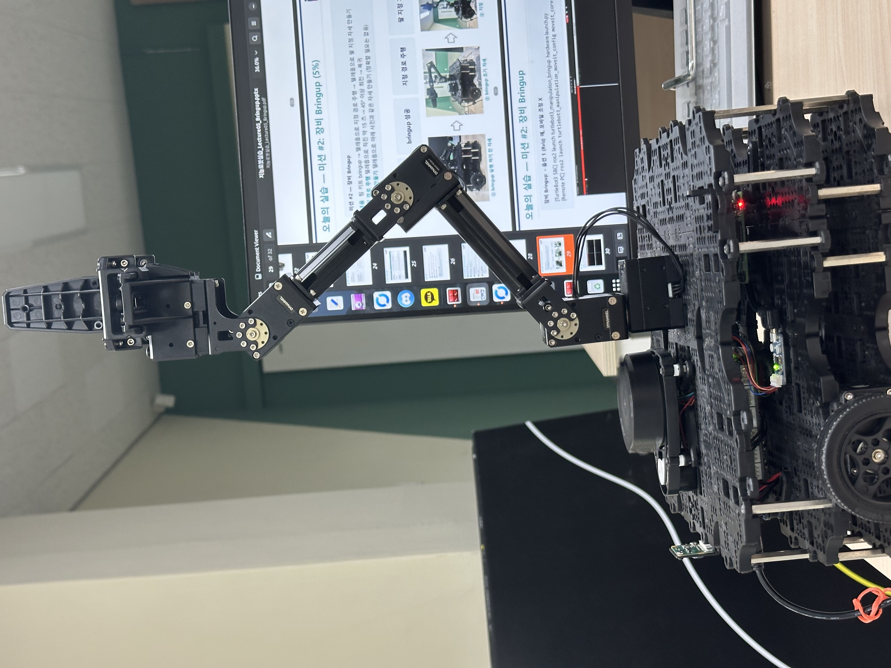
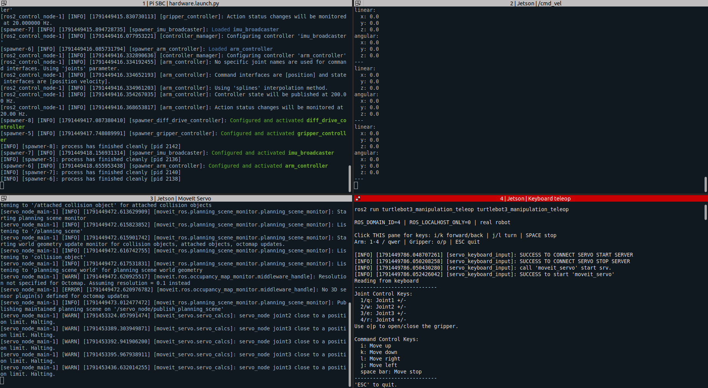

# Mission 2 · TurtleBot3 장비 Bringup

## 목표

- 팀 4의 원격 PC와 라즈베리파이에 ROS 2 통신 환경을 구성한다.
- 실제 TurtleBot3를 bringup하고 키보드로 바퀴 주행과 로봇팔을 조작한다.
- 초기 자세·지정 자세·주행 영상과 컨트롤러 상태로 수행 결과를 확인한다.

## 과정

### 실습 환경과 수행 범위

2026년 10월 8일 팀 4 실습에서 본인 노트북의 Wi-Fi·IP를 설정한 뒤 본인·팀원 PC로 라즈베리파이에 접속했다. Ubuntu 22.04·ROS 2 Humble과 OpenCR 펌웨어를 준비하고, bringup → MoveIt Servo → 키보드 teleop 순서로 로봇을 구동했다. 설치 과정과 저장된 증거의 범위는 [결과 상세](docs/results.md)에 정리했다.

| 구분 | 구성 |
| --- | --- |
| 본인 노트북 | `192.168.0.204`, 초기 네트워크 설정 및 원격 접속 |
| 라즈베리파이 | `192.168.0.21`, Ubuntu 22.04 / ROS 2 Humble, 하드웨어 bringup |
| 팀원 원격 PC | 제공 폴더와 캡처에서 `jetson`으로 표기, Servo·teleop·상태 관찰 |
| ROS 통신 | `ROS_DOMAIN_ID=4`, `ROS_LOCALHOST_ONLY=0` |
| 로봇 | TurtleBot3 Waffle 계열 + OpenMANIPULATOR-X, OpenCR, LDS-01 |



SSH는 라즈베리파이에서 명령을 실행하는 통로이고, ROS 2는 제어 명령과 상태를 전달한다. 공유기는 네트워크 연결을 제공하며 `ROS_DOMAIN_ID`는 각 컴퓨터의 ROS 프로세스에서 설정한다.

### 코드와 상세 설명

ROBOTIS 기반 패키지, 팀 실습용 스크립트와 OpenCR 통신 보정 코드로 구성된다. 팀원이 제공한 Pi·원격 PC 작업공간에서 사용한 경로와 실행 순서를 아래 문서에 연결했다.

| 자료 | 내용 |
| --- | --- |
| [시스템 구조](docs/architecture.md) | 컴퓨터별 역할, SSH와 DDS 차이, 바퀴·팔·그리퍼 제어 경로 |
| [환경 구성과 실행](docs/setup-and-run.md) | IP 설정, 소스 배치, 의존성, 최초 빌드, 네 터미널 실행·종료 |
| [핵심 코드 해설](docs/code-walkthrough.md) | launch, 키 입력, 토픽·액션, 주기와 속도 제한, 실제 발췌 |
| [통신 보정과 문제 확인](docs/hardware-repair.md) | 사전 점검, OpenCR 응답 대기, SDK 패킷 처리, 캡처의 경고 |
| [결과 상세](docs/results.md) | 사진·영상·화면에 대응하는 확인 항목과 측정 한계 |
| [작업공간 안내](workspaces/README.md) | Pi 기본·보정 작업공간 및 팀원 PC 원본 구조·출처 |

처음 실행할 때는 [소스 배치와 최초 빌드](docs/setup-and-run.md)를 먼저 따른다. 당시 설치·빌드가 완료된 환경에서 사용한 핵심 명령은 다음과 같다.

```bash
# 원격 PC → 라즈베리파이: 로봇 구동
ssh ubuntu@192.168.0.21
bash ~/lecture05-setup/bringup-robot.sh
```

```bash
# 원격 PC의 별도 터미널: 팔 Servo
source ~/ire_ws/lecture05-live/robot-env.bash
ros2 launch turtlebot3_manipulation_moveit_config servo.launch.py use_sim:=false
```

```bash
# 원격 PC의 별도 터미널: 키보드 조작
source ~/ire_ws/lecture05-live/robot-env.bash
ros2 run turtlebot3_manipulation_teleop turtlebot3_manipulation_teleop
```

```bash
# 원격 PC의 별도 터미널: 주행 명령 관찰
source ~/ire_ws/lecture05-live/robot-env.bash
ros2 topic echo /cmd_vel
```

`i/k`는 선속도 증가·감소, `j/l`은 각속도 증가·감소, `Space`는 바퀴 정지다. `1~4 / qwer`는 팔 관절의 양·음 방향, `o/p`는 그리퍼 조작이다. 키를 놓아도 마지막 바퀴 속도가 계속 발행되므로 `Space`로 정지한다.

## 결과

컨트롤러 활성화 화면과 실물 사진에서 bringup 및 팔 자세 변경을 확인했고, 주행 영상에서 차체 이동과 방향 전환을 확인했다. 자동 경로 계획이나 목표 관절각 추종 실험이 아닌 키보드 수동 조작이다.



팀원 제공 화면에 `joint_state_broadcaster`, `diff_drive_controller`, `gripper_controller`, `imu_broadcaster`, `arm_controller`가 모두 `active`로 표시되어 있다.

| Bringup 초기 자세 | 키보드로 만든 지정 자세 |
| --- | --- |
|  |  |

초기 자세는 팔이 전방으로 뻗은 상태, 지정 자세는 팔과 그리퍼를 위로 세운 상태다. 강의자료의 예시 형상과 대응하지만 관절각 오차를 측정한 것은 아니다.



왼쪽 위는 Pi bringup, 오른쪽 위는 `/cmd_vel`, 왼쪽 아래는 MoveIt Servo, 오른쪽 아래는 teleop이다. 속도 값 0은 캡처 순간의 정지 명령이다. Servo 화면에는 관절 한계 정지 경고와 3D 센서 플러그인 미설정 메시지가 남아 있다.

- [주행 영상 MP4](results/path-driving.mp4?raw=true): 약 10.80초. 이동·회전은 확인되지만 과제의 `직진 약 15초 → 45° 이상 회전 → 복귀` 전체 조건을 이 영상만으로 검증할 수 없다.
- [Servo 연결 직후 화면](screenshots/mission2-ready-final.png): 서비스 연결과 시작 로그, 키 안내 및 모델 관련 메시지.
- [근거별 결과 설명](docs/results.md): 관찰 결과, 경고, 미측정 항목을 구분했다.
