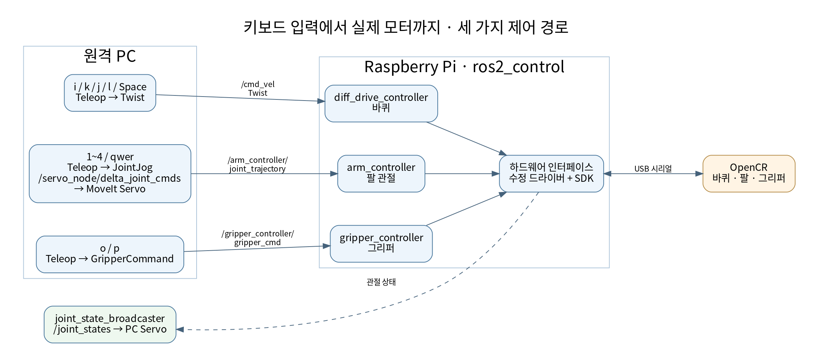
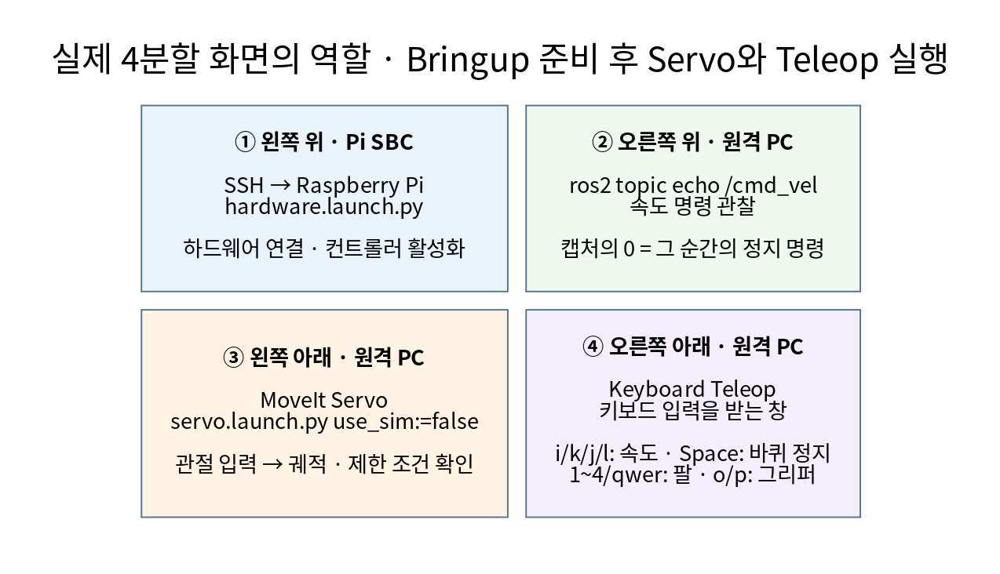

# 시스템 구조와 명령 전달

[미션 2로 돌아가기](../README.md)

## 1. 컴퓨터와 제어 보드의 역할


| 구성 요소 | 하는 일 | 하지 않는 것으로 구분할 일 |
| --- | --- | --- |
| 본인 노트북 | Wi-Fi·IP 설정, 라즈베리파이 접속, 팀 환경 구성 | 팀원 폴더의 모든 파일을 본인이 직접 작성했다는 뜻은 아님 |
| 팀원 원격 PC (`jetson`) | MoveIt Servo, teleop, 토픽 관찰, 4분할 UI | 로봇에 장착된 라즈베리파이와 별도 컴퓨터 |
| 라즈베리파이 | launch와 ROS 2 컨트롤러·드라이버 실행 | 모터의 저수준 제어 루프를 전부 직접 담당하지 않음 |
| OpenCR | USB 명령 수신, 펌웨어를 통한 모터·IMU 처리 | Ubuntu나 ROS 2 Humble을 설치하는 컴퓨터가 아님 |
| DYNAMIXEL | 바퀴·팔 관절·그리퍼 구동과 상태 응답 | 키보드 문자열을 직접 해석하지 않음 |

본인 노트북은 `192.168.0.204`, 라즈베리파이는 `192.168.0.21`이다. 팀원 원격 PC의 실제 IP는 제공 자료에서 확정하지 않는다. 여러 PC가 접속할 때 같은 IP를 함께 사용하면 안 된다.

그림의 공유기 블록에 표시한 `ROS_DOMAIN_ID=4`와 `ROS_LOCALHOST_ONLY=0`은 공유기 설정 항목이 아니다. 같은 네트워크에서 통신하는 **각 ROS 2 프로세스의 환경 변수**다. 같은 네트워크·도메인 외에도 DDS 탐색이 통과할 수 있는 네트워크 상태가 필요하다.

## 2. SSH 접속과 ROS 2 통신

`ssh ubuntu@192.168.0.21`을 실행하면 명령을 입력하는 창은 PC에 있지만 명령의 실행 위치는 라즈베리파이가 된다. 이 창에서 `hardware.launch.py`를 실행하면 드라이버와 컨트롤러는 라즈베리파이에서 동작한다.

반면 PC의 별도 터미널에서 실행하는 teleop과 Servo는 PC의 프로세스다. ROS 2 메시지는 네트워크로 전달되며, SSH 창 안에서 키보드 조작 프로그램을 함께 실행해야 하는 구조가 아니다. 네 터미널은 네 대의 컴퓨터를 의미하지 않는다.

## 3. 바퀴·팔·그리퍼는 다른 경로를 사용한다



### 바퀴 경로

1. `servo_keyboard_input` 노드가 키를 읽고 `geometry_msgs/msg/Twist`를 만든다.
2. `linear.x`에 전후진 속도, `angular.z`에 회전 속도를 저장한다.
3. `/cmd_vel`을 네트워크로 발행한다.
4. `diff_drive_controller`와 하드웨어 인터페이스가 바퀴 구동 명령으로 전달한다.
5. OpenCR과 DYNAMIXEL을 통해 실제 바퀴가 움직인다.

[base.launch.py](../workspaces/jetson/home/jetson/ire_ws/src/turtlebot3_manipulation/turtlebot3_manipulation_bringup/launch/base.launch.py)의 다음 remapping이 속도 입력과 오도메트리 이름을 연결한다.

```python
remappings=[
    ('~/cmd_vel_unstamped', 'cmd_vel'),
    ('~/odom', 'odom')
]
```

### 로봇팔 경로

1. 관절 키 입력으로 `control_msgs/msg/JointJog`를 만든다.
2. `/servo_node/delta_joint_cmds`로 관절 이름과 방향을 보낸다.
3. MoveIt Servo가 로봇 모델·관절 상태·제한 조건을 사용하여 관절 궤적 명령을 만든다.
4. `/arm_controller/joint_trajectory`를 통해 `arm_controller`에 전달한다.
5. Pi 하드웨어 드라이버와 OpenCR을 거쳐 팔이 움직인다.

따라서 바퀴가 움직인다고 팔 제어 경로까지 준비된 것은 아니다. 팔을 조작하려면 Servo 실행과 서비스 연결 상태도 확인해야 한다. 이번 실습은 목표 위치를 넣고 자동 계획하는 MoveIt 사용법이 아니라 관절별 키보드 조작이다.

### 그리퍼 경로

`o/p` 키는 `control_msgs/action/GripperCommand`의 목표를 `gripper_controller/gripper_cmd`에 보낸다. 그리퍼는 팔의 JointJog와 다른 액션 경로다. 코드에는 열기 `0.025`, 닫기 `-0.015`의 위치 목표가 있지만 실제 개구 폭의 별도 측정 결과는 없다.

## 4. 상태를 되돌려 받는 경로

| 이름 | 쓰임 | 이번 자료에서 확인한 범위 |
| --- | --- | --- |
| `/cmd_vel` | 바퀴에 보낸 속도 명령 | 4분할 캡처에서 0 값 확인; 실제 속도 센서값은 아님 |
| `/joint_states` | 관절 상태 전달, 모델과 Servo 입력 | broadcaster active와 Servo의 수신 대기 로그; 수치 시계열은 없음 |
| `/odom` | 주행 오도메트리 | 설정은 `open_loop: true`; 별도 기록 없음 |
| `/scan` | LDS-01 레이저 스캔 | launch에 드라이버 포함; 실제 스캔 메시지 캡처 없음 |
| `/arm_controller/joint_trajectory` | Servo가 만든 팔 궤적 명령 | 코드·설정상 연결; 저장된 메시지 로그 없음 |

`/odom`은 제공 설정에서 명령을 적분하는 open-loop 방식이다. 바퀴 미끄러짐과 실제 이동 오차를 반영한 외부 측정값이나 엔코더·IMU 융합 결과로 설명하지 않는다.

## 5. 다섯 컨트롤러의 역할

| 이름 | 역할 |
| --- | --- |
| `joint_state_broadcaster` | 관절 상태 발행 |
| `diff_drive_controller` | 좌·우 바퀴의 차동구동 제어 |
| `imu_broadcaster` | IMU 상태 발행 |
| `arm_controller` | 팔 관절 궤적 처리 |
| `gripper_controller` | 그리퍼 위치 액션 처리 |

이들은 `controller_manager`가 관리하는 컨트롤러·브로드캐스터다. 각각이 모두 독립 프로세스로 실행된다고 해석하지 않는다. [설정 파일](../workspaces/jetson/home/jetson/ire_ws/src/turtlebot3_manipulation/turtlebot3_manipulation_bringup/config/hardware_controller_manager.yaml)의 관리 루프는 100 Hz이며, 실제 주기 지터는 측정하지 않았다.

## 6. 4분할 창과 실행 순서



bringup으로 하드웨어를 준비한 다음 Servo와 teleop을 실행하고, 별도 창에서 명령을 관찰한다. 터미널 배치는 위·아래·좌·우의 역할을 보여 주는 것이며, 네 프로그램을 무조건 동시에 시작하라는 의미가 아니다.

- 왼쪽 위: SSH 접속 후 Pi bringup 또는 이미 실행 중인 bringup 세션 관찰.
- 오른쪽 위: 원격 PC의 `/cmd_vel` 관찰.
- 왼쪽 아래: 원격 PC의 MoveIt Servo.
- 오른쪽 아래: 원격 PC의 키 입력. 이 영역을 클릭해야 키가 teleop으로 들어간다.

[실제 창 생성 스크립트](../workspaces/jetson/home/jetson/ire_ws/lecture05-live/ui/launch-four-pane.sh)는 기본 실행 시 준비 화면만 표시한다. `--live`가 실제 실행 모드다. [pane.sh](../workspaces/jetson/home/jetson/ire_ws/lecture05-live/ui/pane.sh)에는 팀원 전용 SSH 소켓 경로와 세션 이름이 있으므로, 다른 컴퓨터에서는 [개별 터미널 실행](setup-and-run.md)을 따른다.
