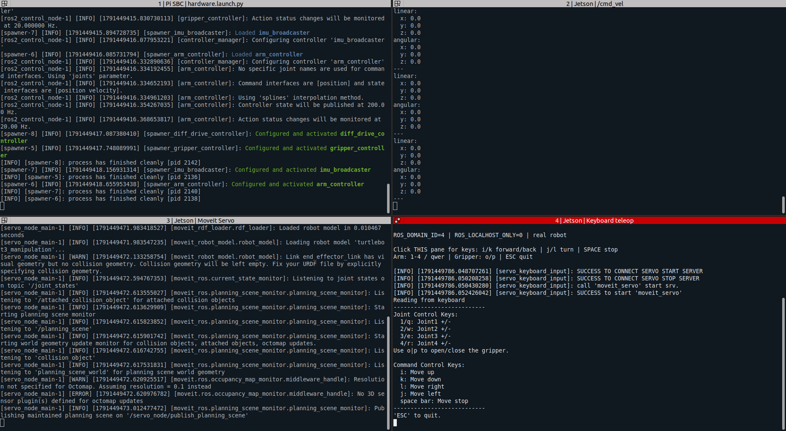

# 결과 자료와 확인 범위

[미션 2로 돌아가기](../README.md)

## 1. 과제 요구와 관찰 근거

제공된 Lecture05 Bringup 자료의 미션 2 요구는 `SSH 접속 → bringup 성공 → 지정 경로 주행 → 팔 지정 자세`다. 지정 경로는 직진 약 15초, 45° 이상 회전 후 복귀이며, 팔 자세는 예시 형상과 유사하게 만드는 과제다.

| 확인 항목 | 근거 | 확인한 범위 |
| --- | --- | --- |
| 네트워크·SSH | 수행자 설명, 원본 `pane.sh`의 접속 주소 | 노트북 `.204`, Pi `.21`, 팀 4. 별도 SSH 인증 성공 로그는 없음 |
| Bringup | 컨트롤러 상태 캡처 | 다섯 컨트롤러가 모두 active |
| 초기 자세 | 초기자세 사진 | 팔이 전방으로 뻗은 형상, 강의 초기 자세 예시와 대응 |
| 주행 | 약 10.80초 MP4 | 차체 위치와 방향 변화, 바닥에서 주행 |
| 지정 자세 | 지정자세 사진 | 팔과 그리퍼가 위를 향하도록 형상 변화 |
| 팔 제어 연결 | Servo·teleop 캡처 | 서비스 연결·시작 메시지, 입력 안내 |

Ubuntu 22.04·ROS 2 Humble 환경 전환과 OpenCR 펌웨어 설치는 수행자 설명에 근거한다. 설치 스크립트는 있으며 OS 설치·펌웨어 업로드 로그는 없다.

## 2. Bringup 컨트롤러 화면

팀원 제공 화면 위쪽은 컨트롤러 이름·종류와 `active` 상태, 아래쪽은 저장된 활성화 로그를 표시한다. 다섯 컨트롤러 상태는 이 캡처에서 확인할 수 있다.

- `joint_state_broadcaster`: 관절 상태 제공.
- `diff_drive_controller`: 바퀴 주행 제어.
- `gripper_controller`: 그리퍼 제어.
- `imu_broadcaster`: IMU 상태 제공.
- `arm_controller`: 팔 관절 궤적 제어.

## 3. 초기 자세와 지정 자세

| 초기 자세 | 지정 자세 |
| --- | --- |
|  |  |

초기 사진에서는 상부 링크와 그리퍼가 전방으로 뻗어 있다. 지정 사진에서는 관절 형상을 바꾸어 팔을 높이고 그리퍼를 위쪽으로 세웠다. 강의자료의 초기·지정 자세 예시와 대응한다. 사진은 동작 전후의 정지 형상을 보여 주며, 모든 관절이 어떤 순서로 몇 도 움직였는지까지 복원할 수는 없다.

팔 자세 변경 결과는 두 정지 사진에 기록되어 있다. 동작 중 영상은 주행 MP4 한 개다.

## 4. 경로 주행 영상

[원본 주행 영상 다운로드·재생](../results/path-driving.mp4?raw=true)

영상 길이는 프레임 수 324 / 프레임률 약 29.995 fps 기준 약 10.802초다. 차체의 이동과 방향 전환을 확인할 수 있다. 카메라 투영과 촬영 위치의 영향이 있으므로 화면상의 픽셀 변화만으로 실제 이동 거리나 회전각을 산출하지 않았다.

영상 전체가 강의 요구의 직진 약 15초보다 짧아 전체 경로와 시간 조건은 이 파일만으로 확인할 수 없다. 정확한 회전각, 원위치 복귀 오차와 실제 속도는 별도 계측 자료가 없다.

## 5. 4분할 터미널

| 영역 | 관찰 내용 |
| --- | --- |
| 왼쪽 위 | Pi bringup 로그와 컨트롤러 활성화 |
| 오른쪽 위 | `/cmd_vel`의 linear·angular 값이 모두 0 |
| 왼쪽 아래 | Servo planning scene 관련 로그, 3D 센서 오류, 관절 한계 정지 경고 |
| 오른쪽 아래 | Servo 서비스 연결·시작 메시지와 키 안내 |

속도 토픽의 0은 캡처 시점의 정지 명령이다. 실제 바퀴의 정지 오차를 측정한 값이나 영상 전체의 주행 속도가 아니다.

이 화면은 팀원 보존본에 포함된 별도 시점이다. `end_effector_link`의 collision geometry 부재 메시지와 Octomap 관련 메시지를 확인할 수 있다. 자세 변경과 주행이 가능했던 사실과 환경 모델·충돌 모델의 완전성은 구분한다.

## 6. 이번 결과의 의미

실제 로봇의 ROS 2 구동, 원격 키 입력에 의한 주행, 팔 자세 변경을 확인했다. 사진과 영상 중심의 정성적 실습 결과이며 자율 경로 추종, 정밀 위치 제어, SLAM, 충돌 회피 성능을 검증한 실험은 아니다.

제공 설정의 `/odom`은 open-loop 명령 적분이다. 이번 자료에는 외부 위치 측정과 관절각 오차 기록이 없어 이동·자세 정확도의 정량 비교는 포함되지 않는다.
