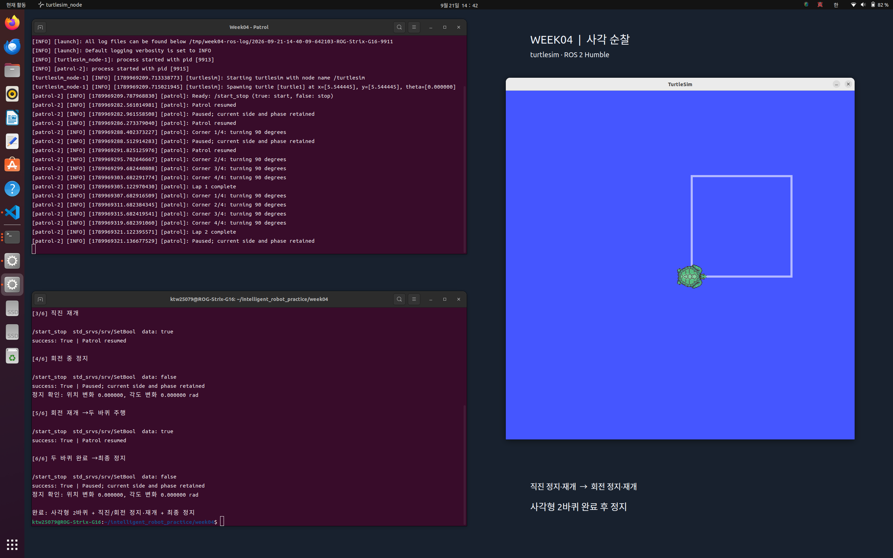

# week04 보고서 초안 — turtlesim 사각 순찰

## 목표

- ROS 2의 토픽으로 위치를 수신하고 속도를 발행하여 사각 경로를 반복 주행한다.
- `SetBool` 서비스로 직진·회전 중 정지하고 남은 동작부터 재개한다.
- launch 파일로 시뮬레이터와 제어 노드를 함께 실행하고 로그와 화면으로 결과를 확인한다.

## 과정

### 1. 코드 구성과 통신

Ubuntu 22.04와 ROS 2 Humble의 turtlesim을 사용한다. 패키지명은 `mission1_202402312`, 실행 파일명은 `patrol`이다. 제공받은 패키지를 참고해 AI 도움으로 제어 로직을 재구성한 코드이며, 원본 패키지명과 작성자 메타데이터를 유지했다.

| 파일 | 역할 |
| --- | --- |
| [patrol.py](mission1/mission1_202402312/patrol.py) | `/patrol` 노드, 위치 수신, 속도 발행, 서비스 처리 |
| [square_motion.py](mission1/mission1_202402312/square_motion.py) | 이동 거리·방향 오차 계산과 직진·회전 상태 전환 |
| [patrol.launch.py](mission1/launch/patrol.launch.py) | `/turtlesim`과 `/patrol` 동시 실행 및 파라미터 전달 |
| [test_square_motion.py](mission1/test/test_square_motion.py) | ROS 없이 운동학 모형으로 제어기 검증 |

다음은 `Patrol.__init__()`의 실제 코드 일부다.

```python
self.velocity = self.create_publisher(Twist, '/turtle1/cmd_vel', 10)
self.create_subscription(Pose, '/turtle1/pose', self.receive_pose, 10)
self.create_service(SetBool, '/start_stop', self.set_running)
self.create_timer(0.02, self.control_step)
```

`/turtle1/pose`에서 위치와 방향을 받아 0.02초 주기, 즉 설정상 50 Hz로 제어한다. `Twist.linear.x`에는 전진 속도, `Twist.angular.z`에는 회전 속도를 넣어 `/turtle1/cmd_vel`로 발행한다. `/start_stop`은 `true`를 받으면 시작·재개하고 `false`를 받으면 정지한다.

### 2. 직진 거리와 회전 방향 계산

제어기는 `DRIVE`와 `TURN` 두 상태를 사용한다. `SquareMotion.command()`에서 현재 위치와 해당 변의 시작 위치 차이를 목표 진행 방향으로 투영하여 이동 거리를 구한다.

```python
dx, dy = x - self.origin[0], y - self.origin[1]
traveled = dx * math.cos(self.heading) + dy * math.sin(self.heading)
remaining = self.side_length - traveled
if remaining <= self.DISTANCE_TOLERANCE:
    self.completed_sides += 1
    self.phase = Phase.TURN
    self.heading = self.initial_heading + (self.completed_sides % 4) * math.pi / 2
    return 0.0, 0.0
```

기본 한 변 길이는 turtlesim 좌표 기준 3.0이며, 남은 거리가 0.01 이하이면 직진을 끝낸다. 다음 목표 방향은 최초 방향에 90도의 배수를 더해 계산한다. 실제 회전이 끝난 방향에 계속 90도를 더하는 방식보다 목표 방향의 오차 누적을 줄일 수 있다.

```python
def angle_error(target, current):
    """-pi ~ pi 범위에서 가장 짧은 회전 방향을 구한다."""
    return math.atan2(math.sin(target - current), math.cos(target - current))
```

각도 차이를 `-π`부터 `π` 사이로 정규화하므로 방향각이 경계를 넘어도 짧은 방향으로 회전한다. `TURN`에서는 전진 속도를 0으로 두고, 각도 오차가 0.002 rad 이하가 되면 다음 직진으로 전환한다. 네 번째 회전을 마쳐야 한 바퀴 완료로 기록한다.

직진 중의 속도 계산은 다음과 같다.

```python
linear = min(self.speed, 3.0 * remaining) if abs(error) < 0.15 else 0.0
return linear, limit(5.0 * error, self.turn_speed)
```

모서리에 가까워질수록 전진 속도를 낮추고 방향 오차에 비례하여 회전 속도를 보정한다. 방향 오차가 0.15 rad 이상이면 전진하지 않는다. 기본 최대 전진 속도는 turtlesim 좌표 단위/s로 2.0, 최대 회전 속도는 3.0 rad/s다.

### 3. 정지와 재개

`set_running()`은 시작 요청 시 유효한 경로와 최근 위치 수신 여부를 검사한다. 검사를 통과한 요청은 다음 코드로 처리한다.

```python
self.enabled = request.data
if not self.enabled:
    self.publish_velocity()
response.success = True
response.message = 'Patrol resumed' if self.enabled else 'Paused; current side and phase retained'
```

인자 없는 `publish_velocity()`는 전진·회전 속도를 모두 0으로 발행한다. 정지 중에도 타이머는 계속 0을 발행하지만 `SquareMotion.command()`는 호출하지 않는다. 따라서 현재 변의 시작 위치와 직진·회전 상태를 유지하고 재개 시 남은 동작을 이어간다.

코드에는 위치 정보가 0.5초를 넘게 수신되지 않으면 속도를 0으로 발행하는 처리도 있다. 최초 위치를 기준으로 예상 사각형의 꼭짓점이 화면 내부에 들어오는지 검사하며, 유효하지 않으면 시작을 거절한다. 이 두 예외 동작은 구현을 확인했으나 저장된 시연 자료에서 별도로 검증되지는 않았다.

### 4. 실행 및 확인 절차

패키지 배치, 환경 설정, 최초 빌드와 터미널별 명령은 [실행 안내](README.md#최초-빌드)에 정리했다. 기본 launch 설정은 `side_length=3.0`, `speed=2.0`, `turn_speed=3.0`, `autostart=false`다.

시연은 시작 → 직진 중 정지 → 직진 재개 → 회전 중 정지 → 회전 재개 → 두 바퀴 완료 후 정지 순서로 진행되었다. 저장된 시연에서는 별도 `rclpy` 클라이언트로 서비스 요청을 자동화했다. 해당 클라이언트 소스는 현재 자료에 없으므로 README의 서비스 명령으로 같은 순서를 수동 재현할 수 있다.

## 결과

### 1. 시연과 측정값

[실행 로그](results/patrol_demo_launch.log)에 `Lap 1 complete`와 `Lap 2 complete`가 기록되었다. [서비스 로그](results/patrol_demo_services.log)의 시작·정지·재개 요청 6건은 모두 `success: True`로 응답했다. 제어기는 계속 순찰하도록 구현되어 있으며, 두 바퀴 후에는 클라이언트의 `false` 요청으로 정지했다.

| 정지 구간 | 정지 전후 위치 변화량 (turtlesim 좌표 단위) | 정지 전후 각도 변화량 (rad) |
| --- | --- | --- |
| 직진 중 정지 | 0.0 | 0.0 |
| 회전 중 정지 | 0.0 | 0.0 |
| 두 바퀴 후 최종 정지 | 0.0 | 0.0 |

위 값은 [저장된 검증 JSON](results/patrol_demo_verification.json)의 실제 측정값이다. 각 구간의 전후 위치·각도가 같고 기록된 전진·회전 속도도 모두 0이었다. JSON에는 측정 시각이나 연속 표본이 없어 이 자료만으로 정지 유지 시간을 산정할 수는 없다.



왼쪽 위 터미널은 두 바퀴 완료 로그, 왼쪽 아래는 서비스 응답, 오른쪽 turtlesim 창은 사각형 궤적과 정지 위치를 보여 준다. 동작 순서는 [시연 영상](results/patrol_demo_2laps.mkv)에서 확인할 수 있다. 한 장의 궤적만으로 반복 횟수를 판단하지 않고 완료 로그를 함께 확인했다.

기존 제어기 테스트 2개도 통과했다. 테스트는 서로 다른 최초 방향에서 세 바퀴 반복, 각도 경계 처리, 속도 제한, 직진 도중 상태 유지 등을 운동학 모형으로 확인한다. 이는 ROS 서비스 통신이나 실제 로봇 주행의 검증과는 구분된다.

### 2. 고찰

이번 실습에서는 위치와 속도처럼 계속 갱신되는 정보에는 토픽을 사용하고, 시작·정지처럼 요청에 대한 응답이 필요한 동작에는 서비스를 사용했다. `/start_stop`의 성공 응답과 실제 위치·각도 측정값을 함께 확인함으로써 명령이 처리되었다는 사실과 거북이가 정지했다는 결과를 각각 확인할 수 있었다.

사각 순찰을 직진과 회전 상태로 나누면 각 단계의 종료 조건이 명확해진다. 직진은 남은 거리, 회전은 목표 방향과의 오차를 기준으로 종료한다. 특히 정지 시 제어 상태를 초기화하지 않았기 때문에 직진 중에도 회전 중에도 기존 동작을 이어갈 수 있었다. 정지·재개 기능을 구현할 때 속도 명령뿐 아니라 진행 상태의 보존이 필요함을 확인했다.

최초 방향을 기준으로 회전 목표를 정하고 모서리 부근에서 감속하는 방식은 사각형 경로를 유지하는 데 도움이 된다. 다만 거리와 각도에 허용 오차가 있고 위치와 속도가 이산적으로 갱신되므로 정확한 좌표 복귀가 항상 보장되지는 않는다. 또한 이 코드는 각 변의 시작 위치를 새로 저장하고 진행 방향의 이동 거리를 제어하므로, 옆 방향으로 누적되는 위치 오차를 원래 사각형의 기준선으로 직접 복원하지는 않는다.

저장된 정지 전후 변화량이 0이라는 결과는 해당 turtlesim 시연 조건에서의 결과다. 실제 로봇에서는 관성, 바퀴 미끄러짐, 위치 추정 오차와 통신 지연 때문에 정지 응답과 궤적이 달라질 수 있다. 후속 검증에서는 반복 횟수에 따른 출발점 복귀 오차와 서비스 요청부터 정지까지 걸리는 시간을 측정하고, 필요하면 고정된 꼭짓점이나 기준 경로에 대한 위치 오차 보정을 추가할 수 있다. 이러한 개선은 이번 실습에서 구현·검증한 성과에 포함하지 않는다.

제출 시에는 이 초안을 지정된 보고서 양식에 옮기고, 제공받은 패키지의 이름·작성자 표기와 본인 기여 범위를 확인해야 한다.
